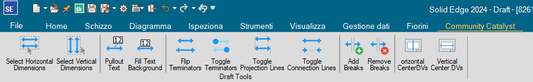

# SolidEdge-DraftTools
Solid Edge utility to change multiple draft objects' characteristics at the same time

From left to right:

- Select all horizontal dimensions
- Select all vertical dimensions
- Pullout text
- Toggle text fill background
- Flip terminators
- Toggle terminators
- Toggle projection lines
- Add projection line breaks
- Remove projection line breaks
- Center views horizontally
- Center views vertically

Tools work on currently selected objects, you can change selection and use the tools as many times as you want
DraftTools can be left open and used as needed

Individual executables of each tool are provided, add them to the Solid Edge ribbon bar, Quick bar, or Radial menu if you prefer a more integrated solution

The latest release in this link: https://github.com/farfilli/SolidEdge-DraftTools/releases
