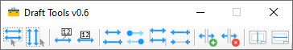

# SolidEdge-DraftTools
Solid Edge utility to change multiple draft object's characteristics at the same time

From left to right:

- Select all horizontal dimensions
- Select all vertical dimensions
- Flip terminators
- Toggle terminators
- Add projection line breaks
- Remove projection line breaks
- Close

Tools work on currently selected objects, you can change selection and use the tools as many times as you want
DraftTools can be left open and used as needed

The latest release in this link: https://github.com/farfilli/SolidEdge-DraftTools/releases/tag/Release
